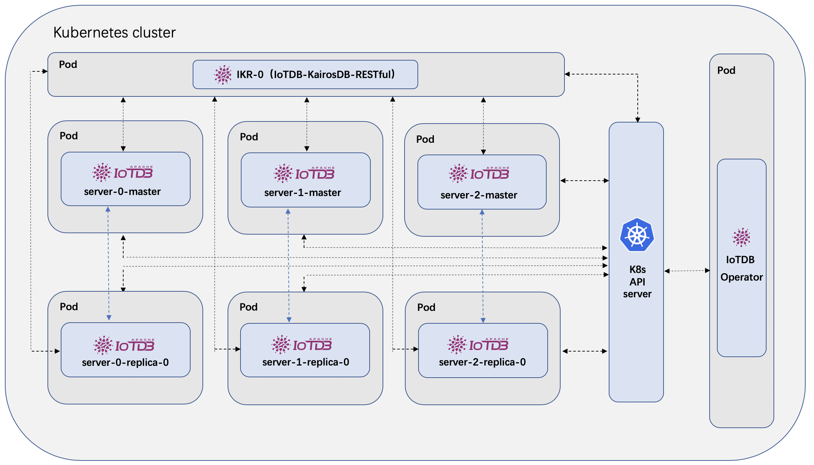

## IoTDB Operator
[](https://www.apache.org/licenses/LICENSE-2.0.html)
[](https://golang.org/)

## Table of Contents
- [Overview](#overview)
- [Quick Start](#quick-start)
  - [Deploy IoTDB Operator](#deploy-iotdb-operator)
  - [Prepare Volume Persistence](#prepare-volume-persistence)
    - [Prepare HostPath](#prepare-hostpath)
    - [Prepare Storage Class of NFS](#prepare-storage-class-of-nfs)
  - [Define Your IoTDB Cluster](#define-your-iotdb-cluster)
  - [Create IoTDB Cluster](#create-iotdb-cluster)
  - [Verify the Data Storage](#verify-the-data-storage)
    - [Verify HostPath Storage](#verify-hostpath-storage)
    - [Verify NFS storage](#verify-nfs-storage)
- [Clean the Environment](#clean-the-environment)
- [Development](#development)
  - [Prerequisites](#prerequisites)
  - [Build](#build)
    - [Operator](#operator)
    - [IKR and IoTDB Server Images](#ikr-and-iotdb-server-images)

## Overview

IoTDB Operator is to manage IoTDB service instances deployed on the Kubernetes cluster.
It is built using the [Operator SDK](https://github.com/operator-framework/operator-sdk), which is part of the [Operator Framework](https://github.com/operator-framework/).



## Quick Start

### Deploy IoTDB Operator

1. Clone the project on your Kubernetes cluster master node:
```
$ git clone https://github.com/liuruiyiyang/iotdb-operator
$ cd iotdb-operator
```

2. To deploy the IoTDB Operator on your Kubernetes cluster, please run the following script:

```
$ ./install-operator.sh
```

3. Use command ```kubectl get pods``` to check the IoTDB Operator deploy status like:

```
$ kubectl get pods
NAME                                      READY   STATUS    RESTARTS   AGE
iotdb-operator-564b5d75d-jllzk         1/1     Running   0          108s
```

Now you can use the CRDs provide by IoTDB Operator to deploy your IoTDB cluster.

### Prepare Volume Persistence

Before IoTDB deployment, you may need to do some preparation steps for IoTDB data persistence. 

Currently we provide several options for your IoTDB data persistence: ```EmptyDir```, ```HostPath``` and ```NFS```, which can be configured in CR files, for example in ```iotdb_v1alpha1_iotdb_cr.yaml```:

```
...
 # storageMode can be EmptyDir, HostPath, NFS
  storageMode: HostPath
...
```

If you choose ```EmptyDir```, you don't need to do extra preparation steps for data persistence. But the data storage life is the same with the pod's life, if the pod is deleted you may lost the data.

If you choose other storage modes, please refer to the following instructions to prepare the data persistence.

#### Prepare HostPath

This storage mode means the IoTDB data (including all the logs and store files) is stored in each host where the pod lies on. In that case you need to create an dir where you want the IoTDB data to be stored on. 

We provide a script in ```deploy/storage/hostpath/prepare-host-path.sh```, which you can use to create the ```HostPath``` dir on every worker node of your Kubernetes cluster. 

```
$ cd deploy/storage/hostpath

$ sudo su

$ ./prepare-hostpath.sh 
Changed hostPath /data/iotdb/iotdb uid to 2000, gid to 2000
```

You may refer to the instructions in the script for more information.

#### Prepare Storage Class of NFS

If you choose NFS as the storage mode, the first step is to prepare a storage class based on NFS provider to create PV and PVC where the IoTDB data will be stored. 

1. Deploy NFS server and clients on your Kubernetes cluster. You can refer to [NFS deployment document](docs/en/nfs_install_en.md) for more details. Please make sure they are functional before you go to the next step. Here is a instruction on how to verify NFS service.

    1) On your NFS client node, check if NFS shared dir exists.
    ```
   $ showmount -e 192.168.130.32
   Export list for 192.168.130.32:
   /data/k8s * 
    ```
    2) On your NFS client node, create a test dir and mount it to the NFS shared dir (you may need sudo permission).
    ```
   $ mkdir -p   ~/test-nfc
   $ mount -t nfs 192.168.130.32:/data/k8s ~/test-nfc
    ```
    3) On your NFS client node, create a test file on the mounted test dir.
    ```
   $ touch ~/test-nfc/test.txt
    ```
   4) On your NFS server node, check the shared dir. If there exists the test file we created on the client node, it proves the NFS service is functional.
   ```
   $ ls -ls /data/k8s/
   total 4
   4 -rw-r--r--. 1 root root 4 Jul 10 21:50 test.txt
   ```

2. Modify the following configurations of the ```deploy/storage/nfs-client.yaml``` file:
``` 
...
            - name: NFS_SERVER
              value: 192.168.130.32
            - name: NFS_PATH
              value: /data/k8s
      volumes:
        - name: nfs-client-root
          nfs:
            server: 192.168.130.32
            path: /data/k8s
...
```
Replace ```192.168.130.32``` and ```/data/k8s``` with your true NFS server IP address and NFS server data volume path.
 
3. Create a NFS storage class for IoTDB, run

```
$ cd deploy/storage
$ ./deploy-storage-class.sh
```

4. If the storage class is successfully deployed, you can get the pod status like:

```
$ kubectl get pods
NAME                                      READY   STATUS    RESTARTS   AGE
nfs-client-provisioner-7cf858f754-7vxmm   1/1     Running   0          136m
iotdb-operator-564b5d75d-jllzk         1/1     Running   0          108s
```

### Define Your IoTDB Cluster

IoTDB Operator provides several CRDs to allow users define their IoTDB service component cluster, which currently includes the IoTDB Server cluster and the IKR cluster.

Check the file ```iotdb_v1alpha1_iotdb_cr.yaml``` in the ```example``` directory, for example:
```
apiVersion: iotdb.apache.org/v1alpha1
kind: IoTDB
metadata:
  name: iotdb
spec:
  # sharding define how the instances are distributed by time and schema
  sharding:
    - scaleTime: "2018-9-20T00:00:00+08:00"
      schemaSegmentNum: 2
    - scaleTime: "2019-5-14T00:53:28+08:00"
      schemaSegmentNum: 3
  # iotdbImage is the customized docker image repo of IoTDB
  iotdbImage: 2019liurui/iotdb-iotdb:0.9.0-alpine
  # replicaNum is the size of replica
  replicaNum: 0
  # imagePullPolicy is the image pull policy
  imagePullPolicy: Always
  # storageMode can be EmptyDir, HostPath, NFS
  storageMode: EmptyDir
  # hostPath is the local path to store data
  hostPath: /data/iotdb/server
  # volumeClaimTemplates defines the storageClass
  volumeClaimTemplates:
    - metadata:
        name: iotdb-storage
        annotations:
          volume.beta.kubernetes.io/storage-class: iotdb-storage
      spec:
        accessModes: [ "ReadWriteOnce" ]
        resources:
          requests:
            storage: 8Gi
  # ikrImage is the customized docker image repo of IKR
  ikrImage: 2019liurui/iotdb-ikr:0.9.0-alpine
  # ikrSize is the number of IKR instance
  ikrSize: 2
```

which defines the IoTDB server cluster scale, the IKR cluster scale and so on.

### Create IoTDB Cluster

1. Deploy the IoTDB cluster by running:

``` 
$ kubectl apply -f example/iotdb_v1alpha1_iotdb_cr.yaml
```

2. After a while when all the IoTDB server pod status is running, the IKR pod will be launched. Then check the status:

```
$ kubectl get pods -owide
NAME                              READY   STATUS    RESTARTS   AGE     IP           NODE             NOMINATED NODE   READINESS GATES
iotdb-0-0-master-0                1/1     Running   0          114s    10.1.0.179   docker-desktop   <none>           <none>
iotdb-0-1-master-0                1/1     Running   0          114s    10.1.0.180   docker-desktop   <none>           <none>
iotdb-1-0-master-0                1/1     Running   0          114s    10.1.0.181   docker-desktop   <none>           <none>
iotdb-1-1-master-0                1/1     Running   0          114s    10.1.0.183   docker-desktop   <none>           <none>
iotdb-1-2-master-0                1/1     Running   0          114s    10.1.0.182   docker-desktop   <none>           <none>
iotdb-ikr-0                       1/1     Running   0          30s     10.1.0.184   docker-desktop   <none>           <none>
iotdb-ikr-1                       1/1     Running   0          22s     10.1.0.185   docker-desktop   <none>           <none>
iotdb-operator-5c57b6667c-mfxkh   1/1     Running   0          2m14s   10.1.0.178   docker-desktop   <none>           <none>
```

We can see that there are 5 IoTDB server pods and 2 IKR pods as we expected and defined in the example CRD file ```iotdb_v1alpha1_iotdb_cr.yaml```.

We can use the port provided by k8s service to access IoTDB and IKR outside the cluster network:
```
$ kubectl apply -f example/service_ikr.yaml

$ kubectl apply -f example/service_iotdb.yaml
```

2. Check the PV and PVC status :
```
$ kubectl get pvc

$ kubectl get pv

```

> Notice: if you don't choose the NFS storage mode, then the above PV and PVC won't be created.

Congratulations! You have successfully deployed your IoTDB cluster by IoTDB Operator.

### Verify the Data Storage

#### Verify HostPath Storage
Access on any node which contains the IoTDB service pod, check the ```hostPath``` you configured, for example:
```
$ ls /data/iotdb/iotdb
logs  store

...
```

#### Verify NFS storage
Access the NFS server node of your cluster and verify whether the IoTDB data have been stored in your NFS data volume path:

```
$ cd /data/k8s/

$ ls

...
```

## Clean the Environment

If you want to tear down the IoTDB cluster, to remove the all the service instances run

```
$ kubectl delete -f example/iotdb_v1alpha1_iotdb_cr.yaml
```

to remove the IoTDB Operator:

```
$ ./purge-operator.sh
```

to remove the storage class for IoTDB:

```
$ cd deploy/storage
$ ./remove-storage-class.sh
```

> Note: the NFS and HostPath persistence data will not be deleted by default.

## Development

### Prerequisites

+ [git](https://git-scm.com/downloads)
+ [go](https://golang.org/dl/) version v1.12+.
+ [mercurial](https://www.mercurial-scm.org/downloads) version 3.9+
+ [docker](https://docs.docker.com/install/) version 17.03+.
+ Access to a Kubernetes v1.11.3+ cluster.
+ [dep](https://golang.github.io/dep/docs/installation.html) version v0.5.0+.
+ [operator-sdk](https://github.com/operator-framework/operator-sdk) version v0.11.0+

### Build

For developers who want to build and push the operator-related images to the docker hub, please follow the instructions below.

#### Operator

IoTDB-Operator uses ```operator-sdk``` to generate the scaffolding and build the operator image. You can refer to the [operator-sdk user guide](https://github.com/operator-framework/operator-sdk/blob/master/doc/user-guide.md) for more details.

If you want to push the newly build operator image to your own docker hub, please modify the ```DOCKERHUB_REPO``` variable in the ```create-operator.sh``` script using your own repository. Then run the build script:

```
$ ./create-operator.sh
```

#### IKR and IoTDB Server Images

IoTDB-Operator is based on customized images of ```IoTDB server``` and ```IKR```, which are build by ```build-iotdb-image.sh``` and similar scripts in the IKR project, which contains customized scripts. Therefore, the images used in the ```IoTDB``` CR yaml files should be build by these scripts.

You can also modify the ```DOCKERHUB_REPO``` variable in the scripts to push the newly build images to your own repository:

```
$ cd images/iotdb
$ ./build-iotdb-image.sh
```

> Note: for users who just want to use the operator, there is no need to build the operator and customized IKR and IoTDB server images themselves. Users can simply use the default official images which are maintained by the IoTDB community. 